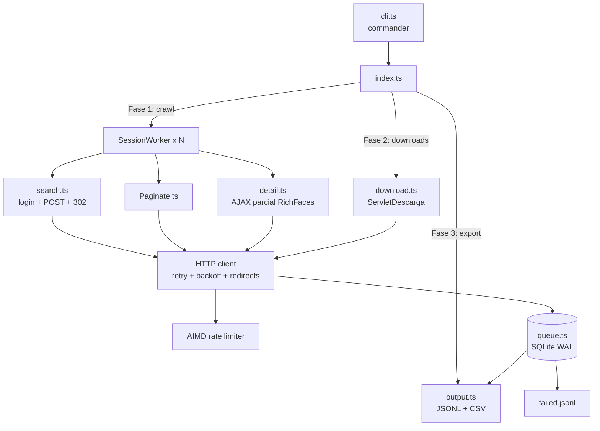

# Scraper Jurisprudencia PJ

[](https://github.com/BrunoMont2003/scraper-challenge/actions/workflows/ci.yml)

Scraper en TypeScript para la Jurisprudencia Nacional Sistematizada del Poder Judicial del Perú. Puro HTTP (`axios` + `cheerio`), sin navegador.

Dado un texto de búsqueda, recorre todas las páginas de resultados, extrae la ficha completa de cada documento, descarga sus archivos (PDF y Word) y deja todo listo para volver a correr sin repetir trabajo.

## Requisitos

- Node.js ≥ 20
- VPN a Perú si tu red no alcanza el sitio (durante el desarrollo respondió sin VPN).

## Instalación

```bash
npm install
```

## Uso rápido

```bash
# Prueba acotada: 3 páginas de "homicidio" (30 docs + sus archivos)
npm run scrape -- --query "homicidio" --pages 3

# Búsqueda completa: todas las páginas y todos los archivos
npm run scrape -- --query "homicidio"

# Todo el sitio: búsqueda vacía en Corte Suprema (~209K documentos)
npm run scrape

# Re-correr es seguro: salta lo ya hecho y reintenta lo que falló
npm run scrape -- --query "homicidio"

# Empezar de cero (borra el estado y re-scrapea todo)
npm run scrape -- --query "homicidio" --fresh
```

### Opciones

| Flag | Default | Qué hace |
|---|---|---|
| `--query <texto>` | `""` | Texto de búsqueda (vacío = todo) |
| `--corte <1\|2>` | `1` | 1 = Corte Suprema, 2 = Corte Superior |
| `--especialidad <id>` | `""` | Filtro por especialidad |
| `--anio <aaaa>` | `""` | Filtro por año de resolución |
| `--pages <N>` | `0` | Límite de páginas (0 = todas) |
| `--max-files <N>` | `0` | Límite de descargas (0 = todos) |
| `--concurrency <N>` | `2` | Concurrencia inicial de descargas |
| `--sessions <N>` | `1` | Sesiones de navegación paralelas (cada una su JSESSIONID). 1 = serial |
| `--min-delay <ms>` | `500` | Delay mínimo entre requests |
| `--out <dir>` | `data` | Directorio de salida |
| `--fresh` | off | Borra el estado y scrapea desde cero |
| `--quiet` | off | Solo errores y resumen final |

## Salida

```
data/
├── results.jsonl      # un documento por línea, 50 campos
├── results.csv        # mismo contenido en CSV
├── pdfs/<nro_exp>__<uuid>.pdf
├── words/<nro_exp>__<uuid>.doc      # cuando existe versión Word
├── failed.jsonl       # documentos fallidos, listos para reintentar
└── scraper.sqlite     # estado de la corrida (resume)
```

Un registro de `results.jsonl`:

```json
{
  "nro_expediente": "000724-2025",
  "recurso": "Recurso de Nulidad",
  "tipo_resolucion": "Ejecutoria Suprema",
  "sala": "Sala Penal Transitoria",
  "fecha_resolucion": "24/07/2026",
  "sumilla": "Al presentarse en la argumentación vicios de motivación insubsanables...",
  "pdf_path": "pdfs/000724-2025__b8c9...pdf"
}
```

> `results.jsonl` / `results.csv` se sobrescriben por corrida y solo contienen
> los documentos de la query actual. Para acumular varias búsquedas usa
> `--out <dir>` distinto por query, o consolida desde `scraper.sqlite`.

## Arquitectura



Fases: **crawl** (paginar + ficha de cada documento, sesiones en paralelo) →
**descargas** (PDF/Word con pool AIMD, independiente de la sesión) →
**export** (JSONL/CSV + manifest de fallidos). Cada fase relee la cola SQLite,
que es la fuente de verdad y hace que re-correr sea idempotente.

## Cómo funciona

El sitio es una aplicación JSF/Mojarra con RichFaces, y la búsqueda vive en la sesión del servidor. Recargar `resultado.xhtml` a secas devuelve la página vacía; para sacar datos hay que reproducir cada POST exacto del formulario y mantener cookie `JSESSIONID` + `javax.faces.ViewState`. El detalle está en [docs/spec.md](docs/spec.md).

La parte tramposa: el botón de búsqueda es `<input type="image">`, que no dispara el action de JSF sin las coordenadas `.x`/`.y`. El 302 posterior apunta a `http://` cuando el resto es HTTPS. Y "Ver Ficha" es un AJAX parcial de RichFaces que exige `javax.faces.partial.event=click` y el formulario completo re-enviado.

Dos detalles que ahorran horas: la sesión expira a mitad de corrida con `ViewExpiredException`, el scraper lo detecta, se re-loguea, re-ejecuta la búsqueda y retoma en la misma página. Y los archivos se bajan por `ServletDescarga?uuid=`, que no requiere sesión, así que la fase de descargas es independiente de la extracción.

## Errores y rate limiting

Los PDFs devuelven 429 con frecuencia. La descarga usa un control de concurrencia estilo TCP: si las cosas van bien sube de a uno, ante un 429 o error 5xx baja a la mitad. Cada request lleva retry con full-jitter backoff y respeta el header `Retry-After`. Los archivos que no logran completarse quedan marcados como fallidos y se reintentan en la siguiente corrida, con delay exponencial según cuántas veces ya fallaron; nunca se aborta por un documento.

Cada archivo se valida por **magic bytes** (`%PDF-`, OLE2 `D0CF11E0`): una página de error de 2KB disfrazada de PDF se rechaza y se marca como fallida en vez de guardarse corrupta.

La cola es idempotente, así que correr dos veces no repite trabajo: hay delay mínimo entre requests, dedupe por `uuid`, y si matas el proceso a la mitad (incluso con Ctrl+C) se retoma donde quedó al volver a abrir. Para borrar todo y empezar de cero, `--fresh`.

## Sesiones paralelas

El sitio guarda el resultado de búsqueda en la sesión del servidor, así que dos
`JSESSIONID` independientes pueden paginar en paralelo sin pisarse (cada una
mantiene su propio `ViewState` rotante). `--sessions 2` reparte las páginas
entre dos sesiones y duplica el throughput del crawl:

```bash
npm run scrape -- --query "homicidio" --sessions 2 --min-delay 300
```

Las descargas de PDF/Word son independientes de la sesión, así que esa fase ya
era concurrente (AIMD) incluso con `--sessions 1`. Ajusta `--min-delay` con
sesiones múltiples para no saturar el servidor.

## Proyecto

```
src/
├── index.ts          # orquestación: crawl → downloads → export
├── cli.ts            # argumentos CLI
├── config.ts         # tipos, defaults y builders de formularios JSF
├── search.ts         # búsqueda: login → POST → 302 → resultados
├── paginate.ts       # paginación
├── detail.ts         # ficha "Ver Ficha" (AJAX parcial)
├── parser.ts         # parse de la página de resultados
├── download.ts       # descarga PDF/Word vía ServletDescarga
├── queue.ts          # cola SQLite (checkpoint, dedupe, retry)
├── ratelimit.ts      # AIMD + full-jitter backoff + semáforo adaptativo
├── session-worker.ts # una sesión de navegación (JSESSIONID + ViewState)
├── output.ts         # writers JSONL/CSV
├── logger.ts         # logs + resumen
└── http/
    ├── client.ts     # wrapper axios: retry, redirects, delays
    └── session.ts    # JSESSIONID + ViewState + detección ViewExpired

docs/spec.md          # especificación completa del sitio
tests/                # vitest, offline con fixtures reales
```

## Desarrollo

```bash
npm run typecheck   # tsc --noEmit
npm run lint        # biome (lint + formato)
npm test            # vitest, sin tocar el servidor
npm run build       # compila a dist/
```

CI (GitHub Actions): `typecheck` → `lint` → `test` → `build` en cada push/PR a `main`.

Los tests usan fixtures reales capturados del sitio (páginas de resultados, la ficha y una respuesta `ViewExpiredException`).
